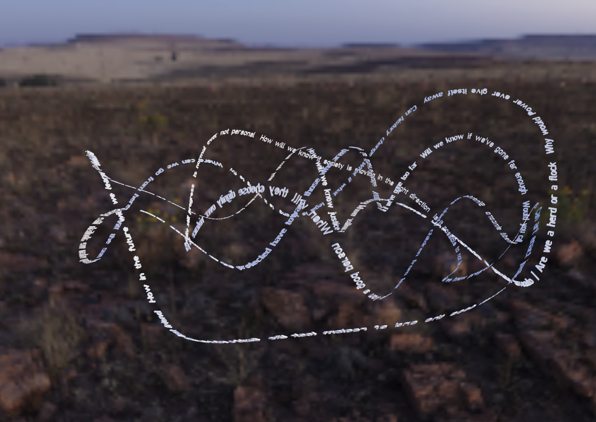
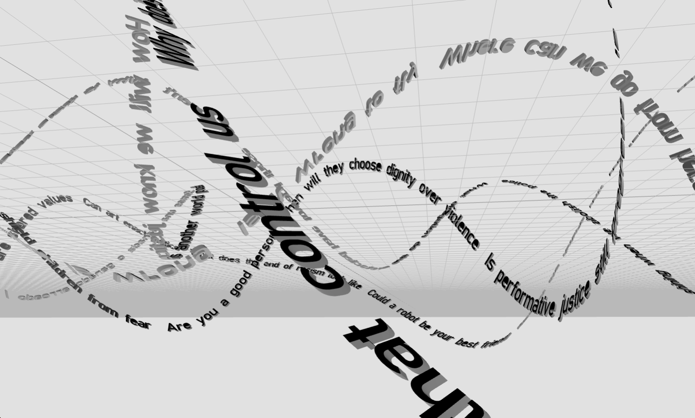

# Moral Labyrinth 2020

This project is a collaboration of Sarah Newman (http://morallabyrinth.com/) and Jenny Fan. This repo backs the live website at http://morallabyrinth2020.com/, which uses Three.js to display the digital 2020 version of the Moral Knot.

### Versions

Version 1 uses these assets to display white text on an HDR background, swiveling back and forth. Click and drag to rotate view.
* clear_2k.hdr
* knot.glb

 

Version 2 (branched: followknot) has no background, and uses a different .glb asset that is updated to track movement with `space`.
* knot.glb (not really sure what knot2.glb is used for)

 